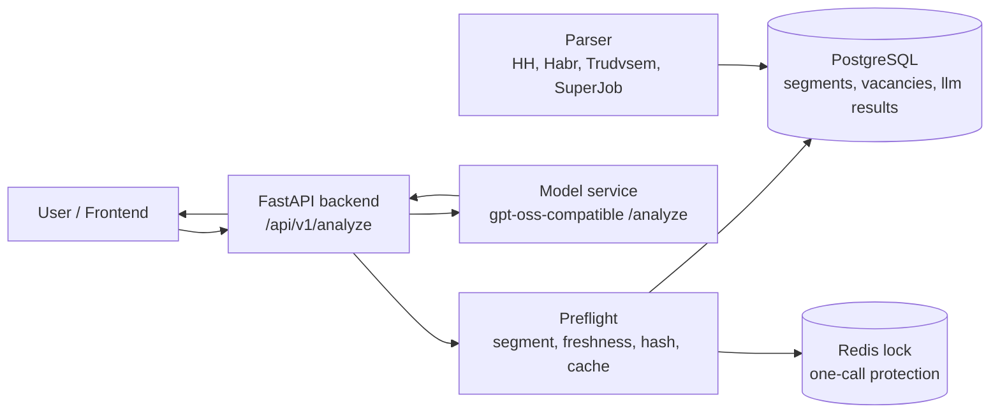

# Zarabotok

**Zarabotok** - hackathon MVP сервиса, который по резюме оценивает потенциальную рыночную вилку дохода и показывает, какие изменения в резюме могут поднять эту вилку.

Проект строится вокруг идеи: пользователь не должен гадать, сколько он стоит на рынке. Он заполняет профиль, получает salary range, факторы оценки и практичные рекомендации, затем правит резюме и пересчитывает результат.

## Ключевые Особенности

- **Реальная продуктовая боль:** многие кандидаты недооценивают себя или не понимают, какие навыки и формулировки влияют на доход.
- **RAG-подход:** backend передает модели не абстрактные знания, а конкретные вакансии-кандидаты из нужного рыночного сегмента.
- **Строгий one-call контракт:** один уникальный `request_hash` = максимум один вызов модели = один сохраненный результат.
- **Backend не подменяет ML:** salary range, квантили, matched/missing skills, factor analysis и recommendations считаются моделью, а backend только валидирует JSON и сохраняет результат.
- **Готовая точка интеграции ML:** сейчас `ml_service` содержит совместимый stub `/analyze`; реальную модель можно вставить, не меняя API backend.
- **Есть тестовые сиды:** можно быстро наполнить БД вакансиями и показать end-to-end flow.

## Демо Flow

1. Пользователь отправляет резюме в `POST /api/v1/analyze`.
2. Backend строит `segment_key`, например `backend_developer:python:moscow:middle`.
3. Preflight проверяет свежесть сегмента и достает `candidate_vacancies`.
4. Backend считает `request_hash` с учетом профиля, версии данных сегмента, модели и промпта.
5. Если такой hash уже есть в БД, возвращается cache без нового вызова модели.
6. Если hash новый, backend вызывает model service ровно один раз.
7. Model service возвращает строгий JSON: salary range, confidence, market sample, skills, factors, recommendations.
8. Backend валидирует техническую корректность JSON, сохраняет valid или failed result и отдает ответ frontend.

## Архитектура



### Компоненты

| Component | Role |
| --- | --- |
| `backend/` | FastAPI API, preflight, cache/idempotency, JSON validation, persistence |
| `ml_service/` | Replaceable GPT-OSS-compatible model boundary; now local stub |
| `parser/` | Vacancy collection and normalization tools |
| `nginx/` | Reverse proxy for local docker setup |
| `postgres` | Stores resumes, market segments, vacancies and model results |
| `redis` | Distributed lock before model call |

## Технологии

- **Backend:** Python 3.11, FastAPI, Pydantic v2, SQLAlchemy async, Alembic
- **Storage:** PostgreSQL 15, JSONB
- **Cache / locking:** Redis 7
- **Model boundary:** GPT-OSS-compatible HTTP contract
- **Infra:** Docker Compose, Nginx
- **Tests:** Pytest, Ruff

## API

### `POST /api/v1/analyze`

Main MVP endpoint. Принимает профиль, запускает preflight и возвращает результат модели или cache.

Request:

```json
{
  "profile": {
    "title": "Python Backend Developer",
    "experience_years": 3,
    "location": "Москва",
    "skills": ["Python", "FastAPI", "PostgreSQL"],
    "resume_text": "Разрабатывал backend-сервисы на FastAPI.",
    "current_salary": 150000
  },
  "options": {
    "target_salary": 250000,
    "force_refresh": false
  }
}
```

Success response shape:

```json
{
  "status": "success",
  "source": "gpt-oss-20b",
  "data": {
    "request_hash": "sha256...",
    "segment": {
      "segment_key": "backend_developer:python:moscow:middle",
      "segment_data_version": "2026-05-16"
    },
    "market_sample": {
      "candidate_vacancies_received": 8,
      "vacancies_used_for_estimation": 5,
      "used_vacancy_ids": ["..."],
      "excluded_vacancies": [],
      "salary_quantiles": {
        "p25": 180000,
        "p50": 220000,
        "p75": 280000
      }
    },
    "salary_range": {
      "min": 180000,
      "median": 220000,
      "max": 280000,
      "currency": "RUB"
    },
    "confidence": {
      "score": 0.8,
      "level": "high",
      "reason": "Fresh candidate vacancies."
    },
    "matched_skills": ["Python", "FastAPI"],
    "missing_skills": [],
    "factor_analysis": [],
    "recommendations": []
  }
}
```

### Other endpoints

| Method | Path | Purpose |
| --- | --- | --- |
| `POST` | `/api/v1/resumes` | Create saved resume draft |
| `GET` | `/api/v1/resumes/{id}` | Read resume draft |
| `PATCH` | `/api/v1/resumes/{id}` | Update resume draft |
| `GET` | `/health` | Backend healthcheck |

## Быстрый Запуск

```bash
cp .env.example .env
docker-compose up --build
```

API docs:

```text
http://localhost:8000/docs
```

Healthcheck:

```bash
curl http://localhost:8000/health
```

## Тестовые Данные Для Демо

После старта контейнеров примените миграции и загрузите seed:

```bash
docker-compose exec backend alembic upgrade head
docker-compose exec backend python -m app.seed_test_data
```

Seed добавляет:

- `backend_developer:python:moscow:middle` - 8 вакансий
- `frontend_developer:react:moscow:middle` - 5 вакансий

После этого demo request из секции API пройдет полный pipeline без ошибки `NO_CANDIDATE_VACANCIES`.

## Настройки Модели

Backend смотрит на model service через переменные окружения:

```env
GPT_OSS_SERVICE_URL=http://ml_service:8001
GPT_OSS_ANALYZE_PATH=/analyze
GPT_OSS_MODEL_NAME=gpt-oss-20b
GPT_OSS_MODEL_VERSION=gpt-oss-20b-salary-v1
GPT_OSS_PROMPT_VERSION=salary_prompt_v1
GPT_OSS_TIMEOUT=60
```

Сейчас `ml_service/app/predictor.py` содержит stub, который возвращает валидный GPT-OSS-compatible JSON. Когда реальная модель будет готова, нужно заменить реализацию `StubPredictor.analyze()` или направить backend на другой service URL.

## База Данных

Ключевые таблицы под MVP:

| Table | Purpose |
| --- | --- |
| `market_segments` | Состояние рыночных сегментов и freshness check |
| `vacancies` | Нормализованные вакансии-кандидаты для RAG |
| `llm_salary_results` | Input/output модели, validation status, cache by `request_hash` |
| `resumes` | Черновики резюме пользователя |
| `audit_log_resumes` | История изменений резюме |

## Гарантии Контракта

Backend валидирует:

- `request_hash` совпадает с input payload;
- `segment_key` и `segment_data_version` совпадают с input payload;
- `salary_range.min <= salary_range.median <= salary_range.max`;
- `currency = RUB`;
- `confidence.score` находится в диапазоне `[0, 1]`;
- `used_vacancy_ids` присутствуют во входных `candidate_vacancies`;
- `recommendations` не пустой массив;
- response соответствует Pydantic-схеме.

Если модель возвращает невалидный JSON, retry не выполняется. Backend сохраняет failed result и возвращает `LLM_OUTPUT_VALIDATION_FAILED`.

## Тесты И Качество

Backend:

```bash
cd backend
python -m ruff check app tests
python -m pytest
```

Model service:

```bash
cd ml_service
python -m ruff check app tests
python -m pytest
```

На момент последней проверки:

- backend tests: `50 passed`
- ml_service tests: `8 passed`
- Ruff: без ошибок

## Структура Репозитория

```text
.
├── backend/
│   ├── app/
│   │   ├── api/v1/          # FastAPI routes
│   │   ├── models/          # SQLAlchemy models
│   │   ├── schemas/         # Pydantic contracts
│   │   ├── services/        # preflight, model client, validation pipeline
│   │   └── seed_test_data.py
│   ├── alembic/             # migrations
│   └── tests/
├── ml_service/
│   ├── app/                 # GPT-OSS-compatible model boundary
│   └── tests/
├── parser/                  # vacancy parsers and normalization
├── nginx/
└── docker-compose.yml
```

## Roadmap

- Подключить реальную `gpt-oss-20b` модель вместо stub.
- Подключить segment-scoped parser refresh из preflight.
- Добавить pgvector/vector search для retrieval.
- Добавить frontend/mobile screen: resume form, result, recommendations, recalculation history.
- Добавить auth/rate limiting для production mode.

## Hackathon Note

MVP специально разделяет ответственность: backend надежно готовит данные, защищает от дублей и сохраняет результаты, а модель отвечает за смысловую аналитику. Это позволяет команде независимо развивать ML-часть и не переписывать API, когда реальная модель будет готова.
