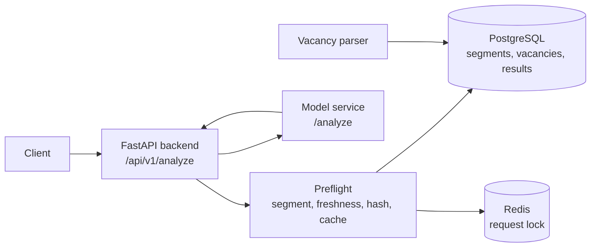

# Zarabotok

Zarabotok - сервис оценки потенциального дохода по резюме. Пользователь заполняет профиль, получает рыночную вилку зарплаты, объяснение факторов оценки и рекомендации по улучшению резюме. После изменения профиля можно повторно запустить расчет и сравнить новый результат с предыдущим.

Проект состоит из backend API, сервиса модели, парсера вакансий и инфраструктуры для локального запуска. Backend отвечает за прием данных, подготовку рыночного сегмента, защиту от повторных вызовов модели, валидацию ответа и сохранение результата. Модель отвечает за смысловую аналитику: выбор релевантных вакансий, расчет квантилей, salary range, анализ навыков и рекомендации.

## Как Работает Расчет

1. Клиент отправляет профиль резюме в `POST /api/v1/analyze`.
2. Backend валидирует входные данные и определяет рыночный сегмент `segment_key`.
3. Preflight проверяет свежесть данных сегмента и получает список `candidate_vacancies`.
4. Backend рассчитывает `request_hash` на основе профиля, сегмента, версии данных, версии модели и версии промпта.
5. Если результат с таким `request_hash` уже сохранен, backend возвращает его из cache.
6. Если запрос новый, backend делает один вызов model service.
7. Model service возвращает структурированный JSON с оценкой дохода и рекомендациями.
8. Backend проверяет техническую корректность ответа, сохраняет valid или failed result и возвращает ответ клиенту.

## Архитектура



| Компонент | Назначение |
| --- | --- |
| `backend/` | FastAPI API, preflight, cache/idempotency, JSON validation, persistence |
| `ml_service/` | HTTP boundary для модели; сейчас содержит совместимый stub `/analyze` |
| `parser/` | Сбор и нормализация вакансий из внешних источников |
| `nginx/` | Reverse proxy для локального docker setup |
| `postgres` | Хранение резюме, сегментов, вакансий и результатов модели |
| `redis` | Lock перед вызовом модели для защиты от параллельных дублей |

## Backend Contract

Backend не рассчитывает зарплатную вилку и не формирует рекомендации самостоятельно. Он выполняет только технические операции:

- валидирует входной профиль;
- определяет `segment_key`;
- проверяет свежесть сегмента;
- получает `candidate_vacancies`;
- рассчитывает `request_hash`;
- проверяет cache по `request_hash`;
- вызывает model service один раз для нового hash;
- валидирует JSON-ответ модели;
- сохраняет успешный или невалидный результат в `llm_salary_results`.

Правило идемпотентности:

```text
one request_hash = at most one model call = one saved result
```

Если модель возвращает невалидный JSON, retry не выполняется. Backend сохраняет failed result и возвращает `LLM_OUTPUT_VALIDATION_FAILED`.

## API

### `POST /api/v1/analyze`

Основной endpoint для оценки резюме.

Request:

```json
{
  "profile": {
    "title": "Python Backend Developer",
    "experience_years": 3,
    "location": "Москва",
    "skills": ["Python", "FastAPI", "PostgreSQL"],
    "resume_text": "Разрабатывал backend-сервисы на FastAPI.",
    "current_salary": 150000
  },
  "options": {
    "target_salary": 250000,
    "force_refresh": false
  }
}
```

Response:

```json
{
  "status": "success",
  "source": "gpt-oss-20b",
  "data": {
    "request_hash": "sha256...",
    "segment": {
      "segment_key": "backend_developer:python:moscow:middle",
      "segment_data_version": "2026-05-16"
    },
    "market_sample": {
      "candidate_vacancies_received": 8,
      "vacancies_used_for_estimation": 5,
      "used_vacancy_ids": ["..."],
      "excluded_vacancies": [],
      "salary_quantiles": {
        "p25": 180000,
        "p50": 220000,
        "p75": 280000
      }
    },
    "salary_range": {
      "min": 180000,
      "median": 220000,
      "max": 280000,
      "currency": "RUB"
    },
    "confidence": {
      "score": 0.8,
      "level": "high",
      "reason": "Fresh candidate vacancies."
    },
    "matched_skills": ["Python", "FastAPI"],
    "missing_skills": [],
    "factor_analysis": [],
    "recommendations": []
  }
}
```

### Дополнительные endpoints

| Method | Path | Назначение |
| --- | --- | --- |
| `POST` | `/api/v1/resumes` | Создание черновика резюме |
| `GET` | `/api/v1/resumes/{id}` | Получение черновика резюме |
| `PATCH` | `/api/v1/resumes/{id}` | Обновление черновика резюме |
| `GET` | `/health` | Healthcheck backend |

## Данные И Хранение

Основные таблицы:

| Таблица | Назначение |
| --- | --- |
| `market_segments` | Состояние рыночных сегментов и freshness check |
| `vacancies` | Нормализованные вакансии-кандидаты для передачи модели |
| `llm_salary_results` | Input/output модели, validation status и cache по `request_hash` |
| `resumes` | Черновики резюме |
| `audit_log_resumes` | История изменений резюме |

## Model Service

Backend обращается к model service через настройки:

```env
GPT_OSS_SERVICE_URL=http://ml_service:8001
GPT_OSS_ANALYZE_PATH=/analyze
GPT_OSS_MODEL_NAME=gpt-oss-20b
GPT_OSS_MODEL_VERSION=gpt-oss-20b-salary-v1
GPT_OSS_PROMPT_VERSION=salary_prompt_v1
GPT_OSS_TIMEOUT=60
```

В текущем состоянии `ml_service/app/predictor.py` содержит stub, который возвращает валидный JSON в формате контракта. Реальную модель можно подключить заменой реализации `StubPredictor.analyze()` или изменением `GPT_OSS_SERVICE_URL`.

## Парсер Вакансий

Модуль `parser/` предназначен для сбора и нормализации вакансий. Вакансии приводятся к единому виду:

- зарплата в RUB net monthly;
- нормализованные навыки в `skills_required`;
- регион и опыт;
- источник и ссылка на вакансию;
- raw payload для аудита.

В backend вакансии используются как `candidate_vacancies`: модель получает их в payload и самостоятельно выбирает релевантные для расчета.

## Локальный Запуск

```bash
cp .env.example .env
docker-compose up --build
```

Документация API:

```text
http://localhost:8000/docs
```

Healthcheck:

```bash
curl http://localhost:8000/health
```

## Тестовые Данные

После старта контейнеров примените миграции и загрузите seed:

```bash
docker-compose exec backend alembic upgrade head
docker-compose exec backend python -m app.seed_test_data
```

Seed добавляет два сегмента:

| Segment | Количество вакансий |
| --- | --- |
| `backend_developer:python:moscow:middle` | 8 |
| `frontend_developer:react:moscow:middle` | 5 |

После загрузки seed пример запроса из секции API проходит полный pipeline без ошибки `NO_CANDIDATE_VACANCIES`.

## Проверка Кода

Backend:

```bash
cd backend
python -m ruff check app tests
python -m pytest
```

Model service:

```bash
cd ml_service
python -m ruff check app tests
python -m pytest
```

Текущее состояние проверок:

- backend tests: `50 passed`
- ml_service tests: `8 passed`
- Ruff: без ошибок

## Структура Репозитория

```text
.
├── backend/
│   ├── app/
│   │   ├── api/v1/
│   │   ├── models/
│   │   ├── schemas/
│   │   ├── services/
│   │   └── seed_test_data.py
│   ├── alembic/
│   └── tests/
├── ml_service/
│   ├── app/
│   └── tests/
├── parser/
├── nginx/
└── docker-compose.yml
```

## Дальнейшее Развитие

- подключить реальную модель вместо stub;
- добавить segment-scoped refresh вакансий из preflight;
- подключить vector search для retrieval;
- добавить frontend/mobile экран с формой, результатом, рекомендациями и историей пересчетов;
- добавить авторизацию и rate limiting для production mode.
