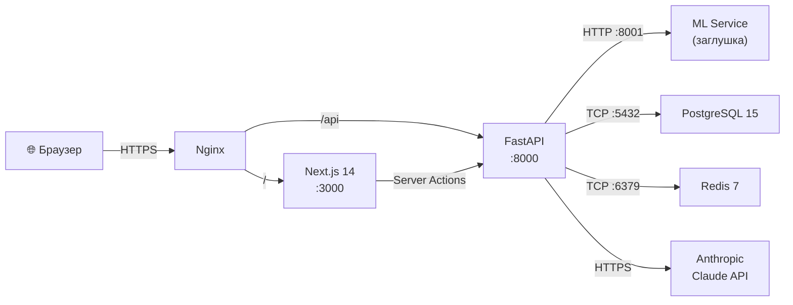
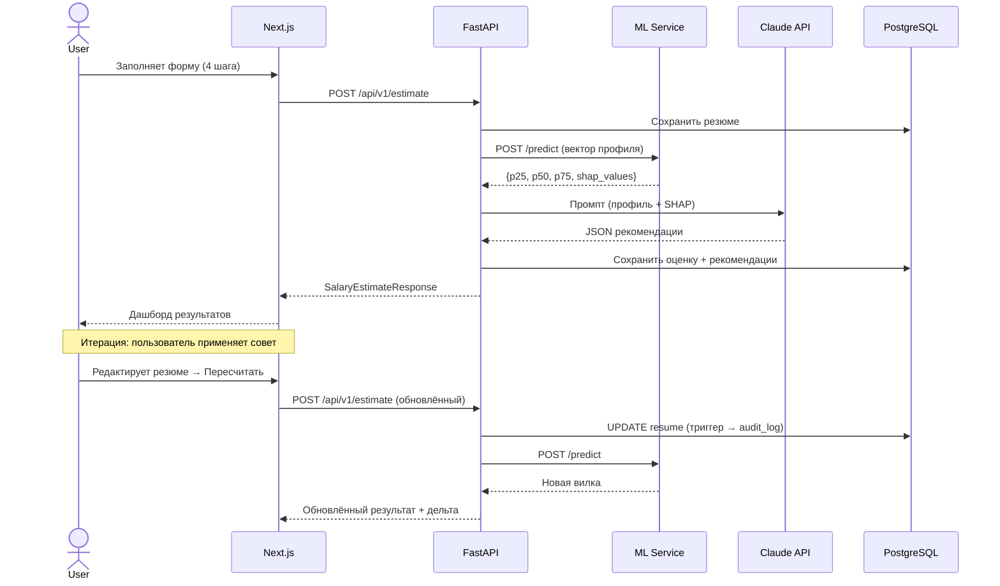
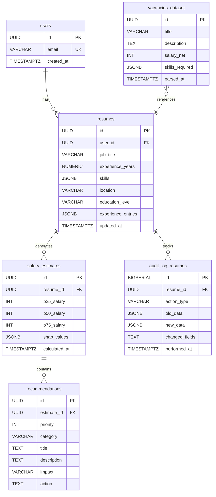

# Архитектура сервиса «Заработок» — План имплементации

## Цель

Создать полную архитектуру монорепозитория для сервиса предиктивной оценки резюме. **ML пишет другой человек** — мы создаём backend (FastAPI), frontend (Next.js 14) и инфраструктуру (Docker). ML-модуль оформляется как изолированный сервис с чёткими интерфейсами-заглушками.

---

## Структура монорепозитория

```
Samosir_tbank/
├── README.md
├── docker-compose.yml
├── docker-compose.prod.yml
├── .env.example
├── .gitignore
│
├── backend/                    # FastAPI Python backend
│   ├── Dockerfile
│   ├── pyproject.toml
│   ├── alembic.ini
│   ├── alembic/
│   │   └── versions/          # Миграции БД
│   ├── app/
│   │   ├── __init__.py
│   │   ├── main.py            # FastAPI app, CORS, lifespan
│   │   ├── config.py          # Pydantic Settings
│   │   ├── dependencies.py    # DI (DB session, Redis, etc.)
│   │   │
│   │   ├── api/
│   │   │   ├── __init__.py
│   │   │   └── v1/
│   │   │       ├── __init__.py
│   │   │       ├── router.py          # Агрегирующий роутер
│   │   │       ├── estimates.py       # POST /estimate, GET /estimate/{id}
│   │   │       ├── resumes.py         # CRUD резюме
│   │   │       ├── recommendations.py # GET рекомендации
│   │   │       └── history.py         # GET /resume/{id}/history
│   │   │
│   │   ├── schemas/            # Pydantic модели (API контракты)
│   │   │   ├── __init__.py
│   │   │   ├── resume.py
│   │   │   ├── estimate.py
│   │   │   └── recommendation.py
│   │   │
│   │   ├── models/             # SQLAlchemy ORM модели
│   │   │   ├── __init__.py
│   │   │   ├── user.py
│   │   │   ├── resume.py
│   │   │   ├── estimate.py
│   │   │   ├── recommendation.py
│   │   │   ├── vacancy.py
│   │   │   └── audit_log.py
│   │   │
│   │   ├── services/           # Бизнес-логика
│   │   │   ├── __init__.py
│   │   │   ├── estimation.py       # Оркестратор оценки
│   │   │   ├── ml_client.py        # HTTP-клиент к ML-сервису
│   │   │   ├── recommendation.py   # Интеграция с LLM (Claude)
│   │   │   └── vacancy_search.py   # Поиск референсных вакансий
│   │   │
│   │   └── db/
│   │       ├── __init__.py
│   │       ├── session.py      # AsyncSession factory
│   │       └── migrations/     # SQL триггеры, функции
│
├── ml_service/                 # ML микросервис (заглушка)
│   ├── Dockerfile
│   ├── pyproject.toml
│   ├── app/
│   │   ├── __init__.py
│   │   ├── main.py            # FastAPI app для инференса
│   │   ├── schemas.py         # Контракт ввода/вывода
│   │   ├── predictor.py       # Загрузка модели + predict (STUB)
│   │   └── models/            # Директория для .pkl/.onnx артефактов
│   │       └── .gitkeep
│   └── README.md              # Инструкции для ML-разработчика
│
├── frontend/                   # Next.js 14 App Router
│   ├── Dockerfile
│   ├── package.json
│   ├── next.config.js
│   ├── tsconfig.json
│   ├── public/
│   ├── src/
│   │   ├── app/
│   │   │   ├── layout.tsx
│   │   │   ├── page.tsx               # Landing
│   │   │   ├── globals.css
│   │   │   ├── resume/
│   │   │   │   ├── page.tsx           # Wizard step router
│   │   │   │   └── steps/
│   │   │   │       ├── PersonalInfo.tsx
│   │   │   │       ├── Experience.tsx
│   │   │   │       ├── Skills.tsx
│   │   │   │       └── Education.tsx
│   │   │   └── results/
│   │   │       └── [id]/
│   │   │           └── page.tsx       # Дашборд результатов
│   │   ├── components/
│   │   │   ├── ui/                    # Базовые UI компоненты
│   │   │   ├── forms/                 # Компоненты форм
│   │   │   ├── results/              # Визуализация результатов
│   │   │   └── layout/               # Header, Footer, Nav
│   │   ├── lib/
│   │   │   ├── api.ts                # HTTP клиент к FastAPI
│   │   │   ├── validations.ts        # Zod схемы
│   │   │   └── utils.ts
│   │   ├── actions/
│   │   │   └── resume.ts             # Server Actions
│   │   └── types/
│   │       └── index.ts              # TypeScript типы
│   └── .env.local.example
│
├── nginx/
│   ├── nginx.conf
│   └── Dockerfile
│
└── shared/                     # Общие контракты
    └── api-contracts/
        └── openapi.yaml        # Единая OpenAPI спецификация
```

---

## Предлагаемые изменения

### 1. Корневые файлы конфигурации

#### [NEW] docker-compose.yml
Orchestration для dev-окружения: `backend`, `ml_service`, `frontend`, `postgres`, `redis`, `nginx`. Все в единой сети `zarabotok-net`.

#### [NEW] docker-compose.prod.yml
Продовый compose с volume-маппингом, healthchecks, restart policies.

#### [NEW] .env.example
Шаблон переменных окружения: `DATABASE_URL`, `REDIS_URL`, `ANTHROPIC_API_KEY`, `ML_SERVICE_URL`, `NEXT_PUBLIC_API_URL`.

#### [NEW] .gitignore
Python, Node.js, Docker, IDE, `.env`, `__pycache__`, `node_modules`, `.next`.

---

### 2. Backend (FastAPI)

#### [NEW] backend/app/main.py
- FastAPI app с lifespan (init DB pool, Redis connection, warm-up)
- CORS middleware для Next.js dev server
- Подключение роутера `/api/v1`

#### [NEW] backend/app/config.py
- `pydantic-settings` для типизированной конфигурации
- Все секреты через env vars

#### [NEW] backend/app/schemas/ (API контракты)
Pydantic v2 модели, соответствующие ТЗ:

```python
# resume.py
class ResumeCreate(BaseModel):
    job_title: str
    experience_years: float
    skills: list[str]
    location: str
    education_level: Literal["none","bachelor","master","phd"]
    experience_entries: list[ExperienceEntry]  # company, title, duration, description

# estimate.py
class SalaryEstimateResponse(BaseModel):
    salary_range: SalaryRange  # p25, p50, p75
    market_insights: MarketInsights  # vacancy_count, skill_match_pct
    recommendations: list[Recommendation]

# recommendation.py
class Recommendation(BaseModel):
    id: str
    priority: int  # 1-5
    category: Literal["hard_skill","soft_skill","formatting","certification"]
    title: str
    description: str
    impact: str  # "+25 000 руб. к медиане"
    action: str
```

#### [NEW] backend/app/models/ (SQLAlchemy ORM)
6 таблиц из ТЗ: `users`, `resumes`, `salary_estimates`, `recommendations`, `vacancies_dataset`, `audit_log_resumes`. Используем `sqlalchemy[asyncio]` + `asyncpg`.

#### [NEW] backend/app/services/estimation.py
Оркестратор: принимает `ResumeCreate` → вызывает `ml_client` → вызывает `recommendation_service` → сохраняет в БД → возвращает `SalaryEstimateResponse`.

#### [NEW] backend/app/services/ml_client.py
HTTP-клиент (`httpx.AsyncClient`) к `ml_service`. Обращается на `POST http://ml_service:8001/predict`. При недоступности ML — fallback на кешированные данные из Redis.

#### [NEW] backend/app/services/recommendation.py
Интеграция с Anthropic Claude API. Собирает промпт из SHAP-значений (от ML) + профиля → запрашивает structured JSON → парсит и кеширует.

#### [NEW] backend/alembic/
Миграции: создание таблиц + PL/pgSQL триггер для `audit_log_resumes`.

---

### 3. ML Service (Заглушка)

#### [NEW] ml_service/app/main.py
Минимальный FastAPI-сервер на порту 8001.

#### [NEW] ml_service/app/schemas.py
```python
class PredictionRequest(BaseModel):
    job_title: str
    experience_years: float
    skills: list[str]
    location: str
    education_level: str

class PredictionResponse(BaseModel):
    p25_salary: int
    p50_salary: int
    p75_salary: int
    shap_values: dict[str, float]  # feature_name → SHAP contribution
    counterfactuals: list[Counterfactual]
```

#### [NEW] ml_service/app/predictor.py
**Заглушка**: возвращает детерминированные значения на основе простых эвристик (опыт × базовая ставка). ML-разработчик заменит на реальную модель CatBoost/LightGBM.

#### [NEW] ml_service/README.md
Документация: контракт API, формат моделей, инструкции по замене заглушки.

---

### 4. Frontend (Next.js 14)

#### [NEW] frontend/ (инициализация через `npx create-next-app`)
- App Router, TypeScript, ESLint
- Vanilla CSS (по требованиям)

#### [NEW] Страницы
| Страница | Путь | Описание |
|---|---|---|
| Landing | `/` | Hero, CTA, описание сервиса |
| Wizard | `/resume?step=1..4` | Многошаговая форма |
| Результат | `/results/[id]` | Дашборд с вилкой и рекомендациями |

#### [NEW] Компоненты форм
- `PersonalInfo` — должность, регион
- `Experience` — динамический массив мест работы
- `Skills` — автокомплит с валидацией по словарю
- `Education` — уровень образования

#### [NEW] Компоненты результатов
- `SalaryGauge` — визуализация p25/p50/p75 (прогресс-бар / спидометр)
- `RecommendationCard` — карточка рекомендации с кнопкой «Применить»
- `HistoryTimeline` — график эволюции зарплатной вилки

#### [NEW] src/lib/validations.ts
Zod-схемы для валидации каждого шага формы.

#### [NEW] src/actions/resume.ts
Server Actions: сохранение черновика, отправка на оценку.

---

### 5. Инфраструктура

#### [NEW] nginx/nginx.conf
- Reverse proxy: `/` → frontend:3000, `/api` → backend:8000
- Gzip, rate limiting headers

#### [NEW] Dockerfiles
- `backend/Dockerfile` — Python 3.11, multi-stage build
- `ml_service/Dockerfile` — Python 3.11, lightweight
- `frontend/Dockerfile` — Node 20, multi-stage (build → standalone)
- `nginx/Dockerfile` — nginx:alpine

---

## Схема взаимодействия сервисов



---

## Пользовательский сценарий (Sequence)



---

## Схема БД



---

## Open Questions

> [!IMPORTANT]
> **Аутентификация**: В ТЗ упоминается таблица `users` с email. Нужна ли полноценная аутентификация (JWT / OAuth) для MVP, или достаточно анонимного использования с идентификацией по session/cookie?

> [!IMPORTANT]  
> **API ключ Anthropic**: Для генерации рекомендаций через Claude нужен API ключ. Он у тебя уже есть, или на этапе MVP заменяем LLM-рекомендации шаблонными?

> [!NOTE]
> **ML-контракт**: Описанный `PredictionRequest/Response` — это предложенный интерфейс для ML-разработчика. Нужно ли согласовать его с ним до начала работы?

---

## Порядок имплементации

| # | Этап | Описание |
|---|------|----------|
| 1 | Скелет монорепо | `.gitignore`, `docker-compose.yml`, `.env.example`, структура директорий |
| 2 | Backend: ядро | FastAPI app, config, DB session, ORM модели |
| 3 | Backend: миграции | Alembic init, создание таблиц, PL/pgSQL триггер аудита |
| 4 | Backend: schemas + API | Pydantic контракты, роутеры, CRUD |
| 5 | Backend: сервисы | Оркестратор оценки, ML клиент, LLM интеграция |
| 6 | ML Service: заглушка | Минимальный FastAPI с mock predictor |
| 7 | Frontend: инициализация | Next.js 14, дизайн-система (CSS), layout |
| 8 | Frontend: формы | Wizard, react-hook-form + zod, Server Actions |
| 9 | Frontend: результаты | Дашборд, визуализация вилки, карточки рекомендаций |
| 10 | Инфраструктура | Dockerfiles, nginx, docker-compose проверка |

---

## Verification Plan

### Automated
- `docker-compose up --build` — все 5 сервисов стартуют без ошибок
- `backend`: `pytest` — тесты API эндпоинтов с mock ML
- `frontend`: `npm run build` — сборка без ошибок
- Curl-тест: `POST /api/v1/estimate` возвращает корректный JSON

### Manual
- Пройти весь wizard в браузере → получить результат
- Нажать «Пересчитать» → увидеть обновлённую вилку
- Проверить `audit_log_resumes` в БД после UPDATE
